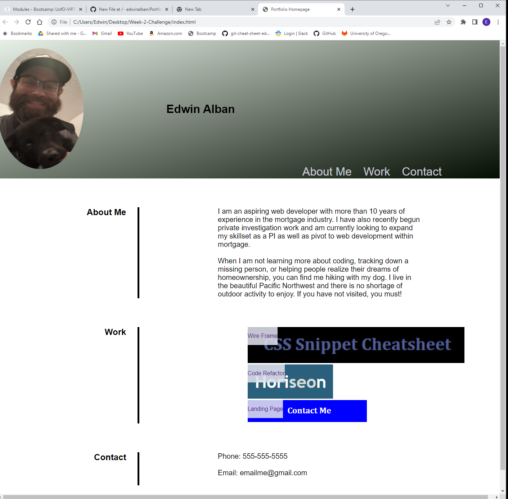

# Portfolio

## Description

I built this project for the purpose of practicing CSS styling and positioning via Flexbox. This project is focused primarily on Flexbox placement, pseudo-element usage, and media queries with a mobile-first, responsive design mindset.
This project can be found here: 

<https://edwinalban.github.io/Portfolio/>

## Installation

N/A

## Usage

This project can be used to practice positioning elements on a webpage primarily using Flexbox. 

